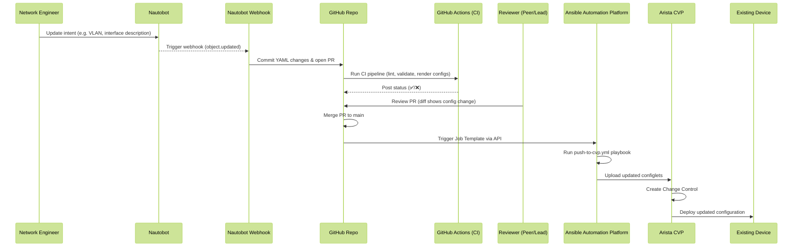
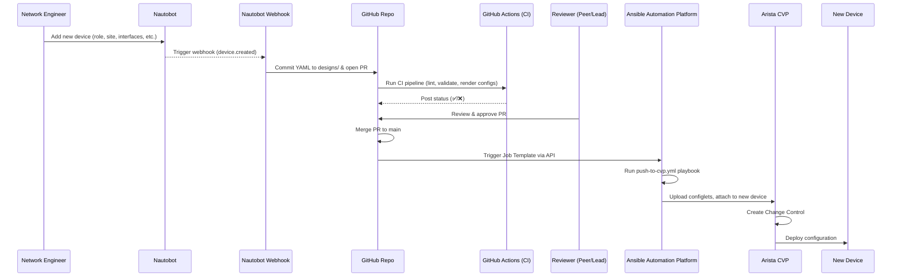
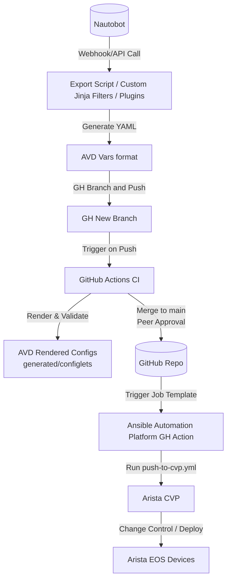

### 2nd Use Case

Nautobot stays authoritative: you don’t duplicate intent into YAML — all truth for IPs, LAGs, VLANs, etc. lives in Nautobot.

AVD remains stateless: it only consumes structured vars in the format it expects, so configs are still deterministic.

Translation layer is explicit: you see the mapping logic from “how we model it in Nautobot” → “how AVD wants it.”

